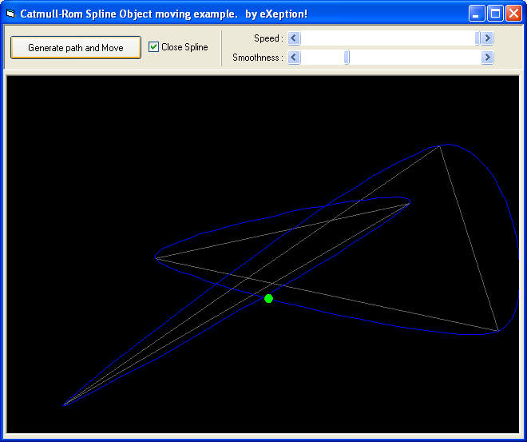

## Code for Flash like  PATH ANIMATION  in your game

### Description

Want to move objects in a smooth curves. A catmull-rom Path moving algorithm is presented here.

This very simple program show you how to:

1) Create smooth path interpolations with the Catmull-rom algorithm (Curve passes smoothly through the control points you provide).

2) Move objects through the path generated.

Forward referencing is used to solve the Catmull-rom cubical equation, where adding the third dimension is just that easy as a Copy-Paste operation.
 
### More Info
 

             |
---                |---
**Submitted On**   |2004-12-27 20:59:04
**By**             |[Hari Krishnan](https://github.com/Planet-Source-Code/PSCIndex/blob/master/ByAuthor/hari-krishnan.md)
**Level**          |Intermediate
**User Rating**    |5.0 (40 globes from 8 users)
**Compatibility**  |VB 4\.0 \(32\-bit\), VB 5\.0, VB 6\.0
**Category**       |[Games](https://github.com/Planet-Source-Code/PSCIndex/blob/master/ByCategory/games__1-38.md)
**World**          |[Visual Basic](https://github.com/Planet-Source-Code/PSCIndex/blob/master/ByWorld/visual-basic.md)
**Archive File**   |[Code\_for\_F19591712232005\.zip](https://github.com/Planet-Source-Code/hari-krishnan-code-for-flash-like-path-animation-in-your-game__1-63771/archive/master.zip)

